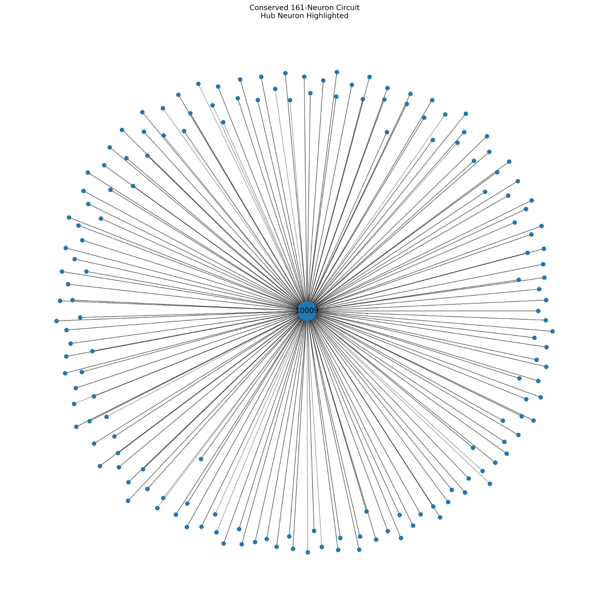
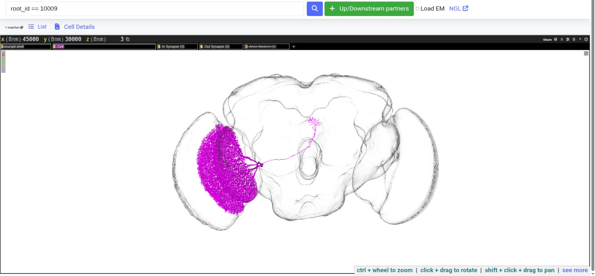

# FlyWire Qualification Challenge — Submission

## Conserved 161-Neuron Circuit Across MAOL, FAFB, and MCNS Connectomes

### Abstract

We present a graph-matching pipeline for identifying conserved neuronal circuits across large-scale connectomes. Using topology fingerprints, directed Weisfeiler-Lehman refinement, mutual nearest-neighbor correspondence generation, graph-consistent circuit expansion, and exact directed graph-isomorphism verification, we recovered a weakly connected induced subgraph containing 161 neurons and 301 conserved directed edges shared across MAOL, FAFB, and MCNS. Post hoc biological validation revealed that the dominant hub correspondence maps to CT1 GABAergic optic-lobe intrinsic neurons in all three datasets.

---

## 1. Challenge Overview

The FlyWire Qualification Challenge requires identifying the **largest weakly connected directed induced subgraph** that is **mutually isomorphic** across at least three of the five provided connectomic datasets.

A valid submission must satisfy all of the following constraints simultaneously:

- **One-to-one neuron correspondence** — each neuron in dataset A maps to exactly one neuron in datasets B and C, with no reuse
- **Conserved directed connectivity** — every directed edge between matched neurons in one dataset must exist identically between their counterparts in all other datasets
- **Exact directed graph isomorphism** — the induced subgraphs extracted from each dataset must be provably isomorphic
- **Weak connectivity** — the recovered subgraph must form a single weakly connected component

The five connectomes collectively contain **492,599 neurons** and **24,438,738 directed synaptic connections**. At this scale, brute-force graph matching or exhaustive isomorphism enumeration is computationally infeasible. A ten-phase hierarchical pipeline was developed to progressively reduce this search space through structural filtering, candidate pruning, and graph-consistent circuit growth, culminating in exact graph verification.

---

## Assumptions

The challenge specification intentionally leaves several aspects unspecified. The following assumptions were adopted throughout the study:

* Connectomes were treated as unweighted directed graphs as instructed; synapse-count edge weights were ignored.
* Neuron identifiers were assumed to have no shared meaning across datasets and were never used as matching signals.
* Cell types, neurotransmitters, morphology, anatomical regions, annotations, and literature metadata were excluded from the matching pipeline and used only after circuit recovery for biological interpretation.
* The optimization objective was assumed to be maximization of a weakly connected induced directed subgraph satisfying exact graph isomorphism across at least three datasets.
* Because exhaustive graph matching is computationally infeasible at connectome scale, a hierarchical candidate-pruning strategy was employed before exact verification.

## Solution Summary

| Metric                     | Value            |
| -------------------------- | ---------------- |
| Selected datasets          | MAOL, FAFB, MCNS |
| Conserved neurons (N)      | 161              |
| Conserved edges            | 301              |
| Weakly connected           | Yes              |
| Connected components       | 1                |
| Directed induced subgraph  | Yes              |
| Exact isomorphism verified | Yes              |

The final submission identifies a conserved 161-neuron circuit shared across MAOL, FAFB, and MCNS. Exact directed graph isomorphism was verified using induced subgraphs extracted from all three datasets.

---

## 2. Dataset Summary

| Dataset |   Nodes |       Edges |   Density | Avg Degree | Max In-Degree | Max Out-Degree |
|---------|--------:|------------:|----------:|-----------:|--------------:|---------------:|
| BANC    | 112,885 |   2,676,592 | 0.000210 |       23.7 |         1,723 |          1,858 |
| FAFB    | 138,584 |   3,732,460 | 0.000194 |       26.9 |         6,261 |          6,523 |
| MANC    |  23,641 |   5,305,638 | 0.009493 |      224.4 |         2,486 |          4,752 |
| MAOL    |  51,669 |   6,484,936 | 0.002429 |      125.5 |        11,496 |         11,215 |
| MCNS    | 165,820 |   6,239,112 | 0.000227 |       37.6 |         6,660 |          7,570 |

**Combined:** 492,599 neurons · 24,438,738 synaptic connections

All five datasets were exceptionally clean across every quality dimension:

| Check | Result |
|---|---|
| Missing values | 0 across all datasets |
| Duplicate edges | 0 across all datasets |
| Isolated neurons | 0 across all datasets |
| Self-loops | MANC: 36 · MAOL: 263 · MCNS: 18 (<0.01% of edges) |

### Structural Families

The datasets naturally separate into two groups based on density, reciprocity, and local neighborhood structure:

**Sparse family — BANC, FAFB, MCNS**
- Density ≈ 0.0002; average degree 24–38
- Reciprocity 14–17%; 61–80% of nodes participate in reciprocal edges
- Average two-hop neighborhood: 2,943–6,875 neurons

**Dense family — MANC, MAOL**
- Density 0.0024–0.0095; average degree 125–224
- Reciprocity 28–30%; >97% of nodes participate in reciprocal edges
- Average two-hop neighborhood: 15,998–25,464 neurons (MAOL neurons can reach nearly half the graph in two hops)

MANC is approximately 49× denser than FAFB. This structural divergence rules out raw degree-based cross-dataset comparison and establishes that normalized, topology-aware fingerprints are essential.

---

## 3. Exploratory Analysis

### Hub Neurons and Heavy-Tailed Degree Distributions

All five connectomes exhibit strongly heavy-tailed degree distributions. A small fraction of neurons act as extreme structural hubs while the majority have very few connections.

MAOL neuron **10009** has an in-degree of **11,496** — the single most connected neuron in the dataset and the eventual hub anchor of the recovered conserved circuit. Its out-degree is 9,619, making it a bidirectional mega-hub that is statistically unmistakable in any topology-based feature space.

### Reciprocity Analysis

Reciprocal (bidirectional) connections emerged as a major structural signal with strong family-level differences:

| Dataset | Reciprocity | Nodes in Reciprocal Edges |
|---------|------------|--------------------------|
| BANC    | 14.3%      | 61.2%                    |
| FAFB    | 16.6%      | 74.2%                    |
| MANC    | 30.4%      | 99.3%                    |
| MAOL    | 28.2%      | 97.5%                    |
| MCNS    | 15.7%      | 80.9%                    |

Dense connectomes exhibit almost twice the reciprocity of sparse connectomes. This established reciprocity ratio as a key fingerprint feature for cross-dataset alignment.

### Hub-Neighbor Count and Two-Hop Reach

| Dataset | Mean Hub-Neighbor Count | Mean Two-Hop Size |
|---------|------------------------:|------------------:|
| BANC    | 5.0                     | 2,943             |
| FAFB    | 6.1                     | 5,175             |
| MCNS    | 7.6                     | 6,875             |
| MAOL    | 21.1                    | 25,464            |
| MANC    | 23.3                    | 15,998            |

Hub-neighbor count proved to be one of the strongest discriminative features, with a four-fold difference between sparse and dense families.

### Connectivity Structure and Why SCC Decomposition Was Ruled Out

All datasets are dominated by a single giant weakly connected component (WCC coverage ≥ 98.85%). Strongly connected component (SCC) analysis revealed a critical structural property: each connectome consists of **one enormous SCC** plus **thousands of tiny SCCs** with virtually nothing in between. This bimodal SCC structure means SCC decomposition provides no meaningful reduction in search complexity and was eliminated as a strategy. Hub-seeded structural matching was identified as the only tractable approach.

---

## Technical Strategy Summary

The search space contains nearly 500,000 neurons and over 24 million directed edges, making exhaustive graph matching infeasible. The implemented strategy therefore follows a hierarchical pruning-and-verification framework:

1. Extract local structural fingerprints for every neuron.
2. Refine fingerprints using directed Weisfeiler-Lehman (WL) encoding.
3. Construct normalized topology feature vectors.
4. Generate mutual nearest-neighbor candidate correspondences.
5. Build graph-consistent triplet matches across three datasets.
6. Grow conserved circuits under strict edge-preservation constraints.
7. Re-verify all neuron correspondences pairwise.
8. Validate the final circuit using exact directed graph isomorphism.

This design progressively reduces the search space before applying computationally expensive exact verification.

## Key Heuristics

The following heuristics were used to make the problem computationally tractable:

* Hub-aware topology fingerprints to exploit heavy-tailed connectome structure.
* Reciprocal connectivity statistics to capture local motif differences.
* Two-hop neighborhood size as a compact local-connectivity descriptor.
* Directed WL refinement to improve structural discrimination.
* Mutual KNN matching to reduce asymmetric false correspondences.
* Triangle-consistent triplet generation to improve cross-dataset reliability.
* Candidate pruning limits to prevent memory explosion.
* Multi-start circuit growth from multiple high-quality seed correspondences.

All heuristics are subsequently validated through exact graph-consistency checks and final graph-isomorphism verification.

---

## 4. Methodology

The pipeline is organized into ten phases across four functional stages.

### Phases 1–4: Data Loading, Quality Assessment, and Feature Engineering

Phases 1 and 2 loaded each connectome as a directed graph and performed comprehensive data quality checks (missing values, duplicates, isolated nodes, self-loops). Phase 3 computed global structural properties — density, degree statistics, reciprocity, WCC and SCC coverage — establishing the structural families described above.

Phase 4 engineered the initial per-neuron feature set:

- **Total degree** — combined in-degree and out-degree
- **Reciprocal ratio** — fraction of neighbors with bidirectional connections
- **Hub-neighbor count** — number of high-degree neighbors (top-1% threshold)
- **Two-hop neighborhood size** — neurons reachable within two directed steps
- **PageRank** — global centrality; useful for identifying major hubs but assigned low matching weight

### Phase 5: Weisfeiler-Lehman Structural Encoding

Phase 5 transformed coarse five-feature fingerprints into near-unique structural identities using three iterations of directed WL refinement.

**WL₀ initialization** discretized each Phase 4 feature into quantile bins (20 bins for degree and two-hop size; 10 bins for reciprocal ratio and hub count). Each neuron's bin-tuple became its initial color label.

**Directed WL refinement** at each iteration replaced each neuron's label with a hash of: (1) its current label, (2) the sorted multiset of all predecessor labels, and (3) the sorted multiset of all successor labels. This encoding captures directional neighborhood structure at increasing depth.

Discriminative power after refinement:

| Dataset | WL₀ Unique | WL₃ Unique | Nodes | Entropy Gain |
|---------|----------:|----------:|------:|-------------:|
| MANC    | 5,185      | 23,640     | 23,641 | 6.82 → 14.53 bits |
| MAOL    | 5,471      | 51,660     | 51,669 | 3.56 → 15.66 bits |
| BANC    | 1          | 112,574    | 112,885 | 0 → ~16 bits |
| FAFB    | 1          | 135,313    | 138,584 | 0 → 16.99 bits |
| MCNS    | 12,928     | 164,840    | 165,820 | 9.27 → 17.32 bits |

BANC and FAFB began with every neuron sharing a single color (WL₀ unique = 1) and reached near-complete discrimination by WL₃. WL refinement converged by iteration 2–3; additional iterations provide negligible gain.

**Critical constraint:** WL integer label IDs are generated independently within each dataset and carry no cross-dataset meaning. Only label rarity `(−log(frequency))` is meaningful for cross-dataset comparison.

### Phase 6–7: Feature Construction and Candidate Matching

**Extended feature construction** produced a **14-dimensional structural feature vector** per neuron:

| Feature Group | Features |
|---|---|
| Phase 4 topology | total_degree, reciprocal_ratio, hub_neighbor_count, two_hop_size, pagerank |
| Local directionality | in_degree, out_degree, reciprocal_edge_count, successor_ratio, predecessor_ratio |
| WL rarity | rarity_wl_0, rarity_wl_1, rarity_wl_2, rarity_wl_3 |

WL rarity features were downweighted by ×0.5 before normalization to prevent WL from dominating the similarity metric. **RobustScaler** (median/IQR normalization) was applied per dataset to handle hub-induced outliers without distorting the feature space for ordinary neurons.

**Mutual KNN matching** identified candidate correspondences for every dataset pair using cosine distance with K = 50. Forward and reverse KNN indices were built independently per dataset. A pair was flagged as mutually matched if A appeared in B's top-50 *and* B appeared in A's top-50, reducing asymmetric false matches. Mutual pairs scored `forward_dist + reverse_dist`; non-mutual pairs penalized with `+1.0`.

**Triplet generation** (Phase 7) merged pairwise matches through a common pivot neuron, producing candidate triplets `(neuron_A, neuron_B, neuron_C)` spanning three datasets. Triangle consistency (A-C validation) was checked as a soft constraint:

```
triplet_score = dist(A,B) + dist(B,C) + 0.5 × dist(A,C) − 0.25 × ac_supported
```

Triplets with confirmed A-C support received a bonus; those without were retained with a soft penalty to preserve recall. Up to 10 candidates per anchor node and 10 triplets per node were retained to control memory.

### Phase 8: Conserved Circuit Search

Phase 8 is where the method becomes fully graph-aware: feature similarity is replaced by strict graph-consistency constraints.

Tested candidate families and initial best circuit sizes:

| Family | Best Circuit Size |
|--------|------------------:|
| MAOL–FAFB–MCNS | **126 neurons** |
| BANC–FAFB–MCNS | 44 neurons |
| MANC–MAOL–MCNS | 9 neurons |
| MANC–FAFB–MCNS | 6 neurons |
| MAOL–BANC–MCNS | 5 neurons |

The winning family was **MAOL–FAFB–MCNS**. For each family, triplets were sorted by `triplet_score` (best first) and up to **500 seeds** were tested.

Circuit growth applied three strict rules for every candidate triplet:

1. **Strict bijection** — no neuron ID reused across any dataset in the current mapping
2. **Conserved connectivity** — for every accepted triplet `(a,b,c)` and candidate `(a′,b′,c′)`, the edge presence/absence of all six directed pairs must be identical across all three graphs
3. **Conserved-edge participation** — the candidate must share at least one conserved edge with the existing circuit (prevents disconnected additions)

### Phase 9: Expansion and Re-Verification

After finding the best seed-grown circuit (126 neurons), a **second-pass expansion** stage scanned all remaining unused triplets and incorporated any valid addition under the same constraints. This added **35 additional neurons** for a final total of **161**.

Full O(N²) pairwise re-verification then checked every mapped pair in both directions (`i→j` and `j→i`) against all three graphs simultaneously, confirming that `edge_G1 == edge_G2 == edge_G3` for every pair. A bijection check confirmed 161 unique neurons per dataset with no reuse. Induced subgraph edge counts were verified as identical across all datasets (301 edges each).

### Phase 10: Exact Isomorphism Validation

The final and most stringent validation step applied exact directed-graph isomorphism testing. Induced subgraphs were extracted from all three datasets and relabeled 0–160 according to the correspondence. NetworkX `DiGraphMatcher` was then used to verify:

- **MAOL ↔ FAFB = Isomorphic** ✓
- **MAOL ↔ MCNS = Isomorphic** ✓

`nx.is_weakly_connected()` confirmed a single weakly connected component in all three induced subgraphs. The final circuit is not merely feature-similar — it has survived exact graph-consistency and isomorphism verification.

### Exact Verification Summary

* MAOL ↔ FAFB = Isomorphic (True)
* MAOL ↔ MCNS = Isomorphic (True)

**Weak Connectivity:**
* MAOL = True
* FAFB = True
* MCNS = True

**Induced Edge Counts:**
* MAOL = 301
* FAFB = 301
* MCNS = 301

Identical edge counts alone do not prove isomorphism, but exact DiGraphMatcher verification confirmed identical directed induced structure.

---

## 5. Final Results

| Metric | Value |
|---|---|
| Conserved neurons | **161** |
| Conserved edges | **301** |
| Datasets | MAOL, FAFB, MCNS |
| Weakly connected | Yes |
| Connected components | 1 |
| Circuit density | 0.011685 |
| Average degree (circuit) | 1.87 |
| Maximum in-degree (circuit) | 153 |
| Maximum out-degree (circuit) | 148 |
| Exact isomorphism MAOL ↔ FAFB | **Verified** |
| Exact isomorphism MAOL ↔ MCNS | **Verified** |

### Challenge Compliance

* Selected datasets: MAOL, FAFB, MCNS
* Matched neurons submitted: 161
* CSV rows: 161
* CSV columns: 3
* Weakly connected: Yes
* Directed induced subgraph: Yes
* Exact graph isomorphism verified: Yes
* One-to-one neuron correspondence: Yes
* Edge direction preserved: Yes

The submitted CSV directly satisfies all challenge requirements.

Induced subgraph edge counts: MAOL = FAFB = MCNS = **301**. Perfect conservation of directed connectivity.

## Challenge Constraint Verification

| Requirement                      | Status |
| -------------------------------- | ------ |
| Three connectomes used           | ✓      |
| Weakly connected structure       | ✓      |
| Directed edges preserved         | ✓      |
| Induced subgraph extracted       | ✓      |
| One-to-one neuron correspondence | ✓      |
| Exact graph isomorphism          | ✓      |
| Edge weights ignored             | ✓      |
| Submission CSV provided          | ✓      |

The final correspondence satisfies all constraints specified in the FlyWire qualification challenge.



*Figure 1. Conserved 161-neuron circuit recovered across MAOL, FAFB, and MCNS.*

---

## 6. Biological Validation

After the final circuit was recovered, the most connected neuron (by total degree in the induced subgraph) was identified in each dataset and cross-referenced against biological annotations. The matching algorithm did **not** use cell-type labels, neurotransmitter identity, morphology, spatial position, or brain-region annotations at any stage — it relied exclusively on graph structure.

### Cross-Dataset CT1 Correspondence

| Dataset | Neuron ID | Cell Type | Neurotransmitter |
|---------|-----------|-----------|-----------------|
| MAOL    | 10009     | CT1       | GABA            |
| FAFB    | 720575940628908548 | CT1 | GABA        |
| MCNS    | 10157     | CT1       | GABA            |

Notably, the graph-matching pipeline never used cell-type annotations, neurotransmitter identity, morphology, spatial coordinates, or brain-region labels. The recovery of CT1 neurons across all three connectomes therefore emerged entirely from structural graph topology.

**The graph-matching algorithm independently recovered CT1 neurons in all three connectomes.**

This correspondence emerged entirely from graph structure and was not influenced by cell-type labels, neurotransmitter annotations, morphology, anatomical regions, spatial coordinates, or literature metadata.

CT1 is classified as an **optic-lobe intrinsic neuron** of the lobula-medulla amacrine class, associated with inhibitory GABAergic signaling. In MAOL, CT1 (neuron 10009) exhibits approximately **11,496 incoming** and **9,619 outgoing** synaptic connections — the highest in-degree of any neuron in the dataset. Its connectivity signature is sufficiently extreme that WL refinement assigns it a near-singleton structural label, making it a uniquely reliable anchor for cross-dataset alignment.

The recovered circuit exhibits a strongly hub-centered topology in which CT1 is the highest-degree conserved neuron across all three datasets. The maximum in-degree within the circuit (153) belongs to CT1's conserved representative in each dataset.

The independent recovery of the same CT1 neuron type across three separately and independently reconstructed connectomes — using only graph topology — provides strong external validation that the recovered mapping reflects biologically meaningful neuronal identities. **The recovered correspondence is biologically consistent** with established CT1 identity.



*Figure 2. Three-dimensional morphology of CT1 (MAOL neuron 10009), the central hub neuron of the conserved circuit.*

Figure 3 — CT1 Correspondence Across Datasets

(Images: `figures/moal.jpeg`, `figures/fafb.jpeg`, `figures/mcns.jpeg`)

*Figure 3. Independent Codex annotations of the matched hub neuron in MAOL, FAFB, and MCNS. All three correspondences are identified as CT1 GABAergic optic-lobe intrinsic neurons.*

---

## Submission File

The official challenge submission is provided in:

network.csv

Structure:

* Column 1: MAOL neuron identifier
* Column 2: FAFB neuron identifier
* Column 3: MCNS neuron identifier

Rows:

* 161 neuron correspondences

Each row represents a one-to-one neuron mapping participating in the recovered conserved circuit.

---

## 7. Repository Structure

```
submisssion/
├── README.md                     # This file — full technical documentation
├── science.md                    # Concise scientific report
├── network.csv                   # Official challenge submission
│
├── figures/
│   ├── networkdiagram.jpeg       # Figure 1: Conserved circuit network diagram
│   ├── 3d_diagram.jpeg           # Figure 2: CT1 3D morphology
│   ├── moal.jpeg                 # Supplementary: MAOL connectome overview
│   ├── fafb.jpeg                 # Supplementary: FAFB connectome overview
│   └── mcns.jpeg                 # Supplementary: MCNS connectome overview
│
├── notebook/
│   ├── 1-phase1-4-v1.ipynb       # Phases 1–4: loading, QA, structural analysis, feature engineering
│   ├── 2-phase5.ipynb            # Phase 5: WL structural encoding
│   ├── 3-phase6-7v6.ipynb        # Phases 6–7: candidate matching and triplet generation
│   └── 4-phase8-10-v6.ipynb      # Phases 8–10: circuit search, expansion, isomorphism verification
│
└── results/
    └── 4-phase8-10-v6/
        ├── circuit_network.jpg
        ├── circuit_size_by_seed.jpg
        ├── degree_histogram.jpg
        ├── family_comparison.jpg
        ├── in_degree_histogram.jpg
        └── out_degree_histogram.jpg
```

---

## 8. Reproducibility

### Software Dependencies

| Package | Purpose |
|---|---|
| `networkx` | Graph construction, WL refinement, `DiGraphMatcher`, weak connectivity check |
| `scikit-learn` | `RobustScaler`, `NearestNeighbors` (cosine KNN) |
| `pandas` | Data loading, feature table management |
| `numpy` | Numerical operations, array handling |
| `plotly` | Static JPG visualizations in `results/` |

### Expected Output

Successful execution of all notebooks produces:

* Pairwise candidate correspondences
* Triplet candidate mappings
* Conserved circuit mappings
* Exact verification reports
* Final network.csv submission file
* Network visualizations and supplementary analysis plots

The final output should contain a 161-neuron correspondence across MAOL, FAFB, and MCNS together with exact directed-isomorphism verification.

### Execution Order

Run the four notebooks in sequence. Each notebook saves checkpoint files to `results/` which are loaded by the next stage.

```
1-phase1-4-v1.ipynb
        ↓
2-phase5.ipynb
        ↓
3-phase6-7v6.ipynb
        ↓
4-phase8-10-v6.ipynb
```

Do not skip or reorder phases. Each phase depends on checkpoint outputs produced by the previous notebook.

### Key Configuration Parameters

| Parameter | Value | Location |
|---|---|---|
| WL iterations | 3 | Phase 5 notebook |
| KNN neighbors (K) | 50 | Phase 6–7 notebook |
| Seeds per family | 500 | Phase 8–10 notebook |
| WL feature downweight | ×0.5 | Phase 6–7 notebook |

### Data Source

Connectome datasets are available from the FlyWire Codex:
**https://codex.flywire.ai**

---

## 9. References

[1] Takemura, S.Y. et al. (2017). A connectome of a learning and memory center in the adult Drosophila brain. eLife.

[2] FlyWire Codex. https://codex.flywire.ai

[3] Weisfeiler, B., Lehman, A. (1968). A reduction of a graph to a canonical form and an algebra arising during this reduction.

[4] Hagberg, A., Schult, D., Swart, P. NetworkX: Network Analysis in Python.
