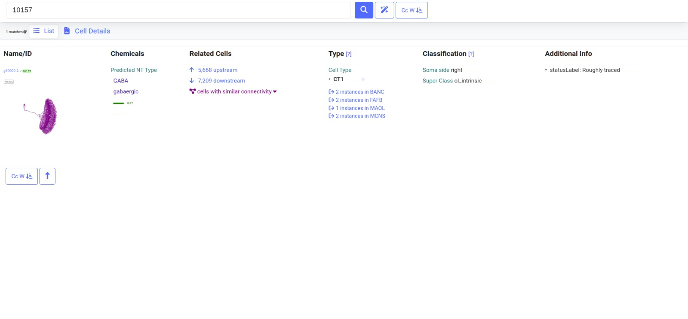

# Identification of a Conserved 161-Neuron Circuit Across MAOL, FAFB, and MCNS Connectomes
**Surjit Mandal**, *International Institute of Information Technology, Hyderabad*

## Introduction
The FlyWire Qualification Challenge required identification of the largest weakly connected directed induced subgraph that is mutually isomorphic across at least three of five provided connectomic datasets. A valid solution must preserve one-to-one neuron correspondence, directed edge structure, induced-subgraph connectivity, and exact graph isomorphism.

To address this problem, we developed a graph-based matching pipeline that progressively reduced the search space using structural fingerprints, Weisfeiler-Lehman (WL) refinement, candidate correspondence generation, graph-consistent circuit growth, and exact isomorphism verification. All connectomes were treated as directed, unweighted graphs, and biological annotations were excluded from the matching process.

**Key Technical Achievements**
* 492,599 neurons analyzed
* 24.4 million synaptic connections analyzed
* 161-neuron conserved circuit recovered
* 301 conserved directed edges
* Exact directed graph isomorphism verified
* Independent CT1 correspondence recovered across three connectomes

## Methods
The analysis pipeline consisted of six stages: *Dataset Loading → Topology Feature Extraction → Directed Weisfeiler-Lehman Structural Encoding → Mutual Candidate Generation → Graph-Consistent Circuit Growth → Exact Isomorphic Subgraph Verification*.

Each neuron was represented using topology-derived features including degree statistics, reciprocity, hub-neighbor counts, and two-hop neighborhood structure. Three iterations of directed WL refinement generated highly discriminative structural signatures. Candidate neuron correspondences were identified using mutual nearest-neighbor matching and assembled into cross-dataset triplets. 

The pipeline combined directed Weisfeiler-Lehman structural encoding, topology-based candidate matching, graph-consistent circuit growth, pairwise edge re-verification, and exact directed graph isomorphism testing.

## Results
The largest conserved circuit was identified across the MAOL, FAFB, and MCNS connectomes. The final solution was recovered from connectomes containing more than 356,000 neurons and 16 million synaptic connections across MAOL, FAFB, and MCNS. Despite substantial differences in graph size and density, exact directed graph isomorphism was verified for the recovered circuit.

**Dataset Family Comparison**
| Dataset Family | Circuit Size |
| :--- | :--- |
| MAOL–FAFB–MCNS | 161 |
| BANC–FAFB–MCNS | 44 |
| MANC–MAOL–MCNS | 9 |
| MANC–FAFB–MCNS | 6 |
| MAOL–BANC–MCNS | 5 |

**Exact Verification Summary**
| Verification Test | Result |
| :--- | :--- |
| Directed induced subgraph | ✓ |
| Weak connectivity | ✓ |
| 1-to-1 correspondence | ✓ |
| Edge preservation | ✓ |
| MAOL ↔ FAFB iso. | ✓ |
| MAOL ↔ MCNS iso. | ✓ |

Multiple dataset families were evaluated during graph-consistent circuit search. The MAOL–FAFB–MCNS family produced the largest exact conserved circuit, containing 161 neurons and 301 conserved directed edges. Final validation was performed using pairwise edge verification and exact directed graph isomorphism testing with NetworkX DiGraphMatcher.

*Figure 1: Conserved 161-neuron circuit recovered across MAOL, FAFB, and MCNS. The induced subgraph contains 161 matched neurons and 301 conserved directed edges. The recovered topology is strongly hub-centered, with CT1 (MAOL neuron 10009) serving as the dominant conserved hub.*

## Biological Analysis
To investigate the biological significance of the recovered circuit, the highest-degree matched neuron was examined using FlyWire Codex annotations. 

**Cross-Dataset CT1 Validation**
| Dataset | Neuron ID | Cell Type | Neurotransmitter |
| :--- | :--- | :--- | :--- |
| MAOL | 10009 | CT1 | GABA |
| FAFB | 720575940628908548 | CT1 | GABA |
| MCNS | 10157 | CT1 | GABA |

The matched hub neurons correspond to CT1 in all three datasets (MAOL neuron 10009, FAFB neuron 720575940628908548, and MCNS neuron 10157), despite cell-type labels, neurotransmitter annotations, morphology, spatial coordinates, and brain-region information never being used during graph matching. This agreement emerged entirely from graph topology and provides strong biological support for the recovered correspondence.

*Figure 2: Independent FlyWire Codex annotation of the matched hub neuron in MAOL. The graph-matching pipeline independently recovered CT1 GABAergic optic-lobe intrinsic neurons across all three datasets despite using only graph structure during matching.*

**Additional metadata for MAOL neuron 10009:**
| Property | Value | Property | Value |
| :--- | :--- | :--- | :--- |
| Cell Type | CT1 | Hemisphere | Right |
| Neurotransmitter | GABA | Volume | 15,444 µm³ |
| Super Class | optic | Upstream | 11,496 |
| Class | optic_lobe_intrinsic | Downstream | 9,619 |
| Subclass | lobula_medulla_amacrine | | |

Importantly, cell-type labels, neurotransmitter identity, morphology, spatial position, and brain-region annotations were not used during matching. The agreement therefore emerged entirely from graph topology.

*Figure 3: Three-dimensional morphology of the conserved CT1 hub neuron (MAOL neuron 10009) obtained from FlyWire Codex. CT1 is a GABAergic optic-lobe intrinsic neuron of the lobula-medulla amacrine class and was independently recovered by the graph-matching pipeline across MAOL, FAFB, and MCNS using graph structure alone.*

## Interpretation
Structural analysis revealed that the recovered circuit exhibits a strongly hub-centered topology in which CT1 is the highest-degree conserved neuron across all three datasets, producing a star-like topology that remains exactly conserved across MAOL, FAFB, and MCNS.

CT1 is a GABAergic optic-lobe intrinsic neuron associated with the lobula-medulla amacrine class and is among the most highly connected neurons in each connectome. In MAOL, CT1 receives approximately 11,496 upstream connections and projects to approximately 9,619 downstream partners. Similar CT1 annotations were independently recovered in FAFB and MCNS.

The fact that the graph-matching algorithm recovered CT1 correspondences across three connectomes without using any biological metadata provides independent biological validation of the discovered mapping. This suggests that CT1 possesses a highly distinctive and strongly conserved connectivity signature.

**Functional Interpretation.** CT1 is a GABAergic optic-lobe intrinsic neuron associated with visual-information processing within the lobula–medulla pathway. The recovered 161-neuron circuit therefore likely represents a conserved inhibitory visual-processing motif involved in integrating and modulating visual signals across multiple *Drosophila* connectomes.

**Hypothesis.** Because CT1 was independently recovered across MAOL, FAFB, and MCNS using graph topology alone, we hypothesize that this circuit represents a highly conserved visual-processing microcircuit whose connectivity architecture has been preserved across independently reconstructed connectomes.

## Discussion
The recovered circuit demonstrates that graph-structure alone can be sufficient to identify biologically meaningful correspondences across independently reconstructed connectomes. Despite substantial differences in graph size, density, and connectivity statistics among MAOL, FAFB, and MCNS, the pipeline recovered a conserved 161-neuron induced subgraph with exact directed graph isomorphism.

The resulting motif is dominated by a single highly conserved CT1 hub neuron. This suggests that maximizing subgraph size under strict isomorphism constraints naturally favors circuits organized around structurally distinctive and highly conserved hub neurons. While no claim of neuronal homology is made beyond biological consistency, the independent recovery of CT1 across all three datasets provides strong support for the validity of the discovered correspondence.

## References
1. Takemura, S.Y. et al. (2017). A connectome of a learning and memory center in the adult Drosophila brain. *eLife*.
2. FlyWire Codex Database. *https://codex.flywire.ai*
3. Weisfeiler, B. and Lehman, A. (1968). A reduction of a graph to a canonical form and an algebra arising during this reduction.
4. Hagberg, A., Schult, D., Swart, P. NetworkX: Network Analysis in Python.